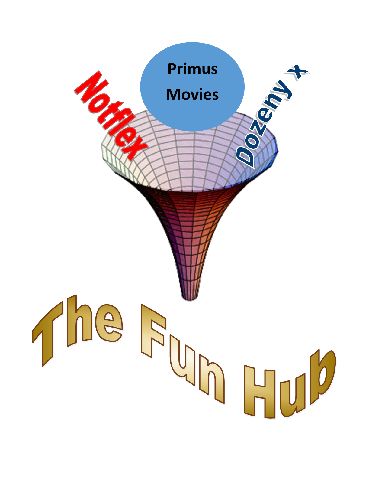

<!-- Improved compatibility of back to top link: See: https://github.com/othneildrew/Best-README-Template/pull/73 -->

<!--
*** Thanks for checking out the Best-README-Template. If you have a suggestion
*** that would make this better, please fork the repo and create a pull request
*** or simply open an issue with the tag "enhancement".
*** Don't forget to give the project a star!
*** Thanks again! Now go create something AMAZING! :D
-->

<!-- PROJECT SHIELDS -->
<!--
*** I'm using markdown "reference style" links for readability.
*** Reference links are enclosed in brackets [ ] instead of parentheses ( ).
*** See the bottom of this document for the declaration of the reference variables
*** for contributors-url, forks-url, etc. This is an optional, concise syntax you may use.
*** https://www.markdownguide.org/basic-syntax/#reference-style-links
-->

<!-- PROJECT LOGO -->
 

  

  <h3 align="center">The Fun Hub</h3>

  

    A project for Simplilearn/IBM SLackathon
     

<!-- TABLE OF CONTENTS -->

  
Table of Contents

  <ol>
    <li>
      <a href="#about-the-project">About The Project</a>
      <ul>
        <li><a href="#built-with">Built With</a></li>
      </ul>
    </li>
    <li>
      <a href="#getting-started">Getting Started</a>
      <ul>
        <li><a href="#prerequisites">Prerequisites</a></li>
        <li><a href="#project workflow">Installation</a></li>
      </ul>
    </li>
    <li><a href="#roadmap">Roadmap</a></li>
    <li><a href="#license">License</a></li>
    <li><a href="#contact">Contact</a></li>
    <li><a href="#acknowledgments">Acknowledgments</a></li>
  </ol>

<!-- ABOUT THE PROJECT -->
## About The Project

The Fun Hub is a project idea for Simplilearn/IBM SLackathon.

I am working on the project during the completion of my Simplilearn Professional Certificate Program In Data Science with University of Purdue in Collaboration with IBM.

Here is the project idea:
* Imagine a OTT service provider "__The Fun Hub__"
* Subscription to the Fun Hub offers you access to the main OTT plateforms (for example Netflix, Disney +, Amazon Prime)
* The Fun Hub algorithm will suggest programs based on preferences, as well as the agremment it signed with the other OTT plateforms based on a ratio of programs from each plateform.

(<a href="#readme-top">back to top</a>)

<!-- Project Idea -->
## project Idea

The prject idea is quite simple. Many OTT plateforms users have to choose between different plateforms, or pay subscriptions to different palteforms.
__The Fun Hub__ is a OTT plateform service has agreements with the main OTT palteforms (say for example Netflix, Amazon Prime Video, Dinsey +) and guarantree to these provides a minimum number of customers and views. The plateforms offer then a discount sube scription price (negociated on the number of views) and access to users preferences data.

__The Fun Hub__ is hence able to offer access to the porfolio of all the OTT plateforms at a competitive price, and the user historical views preferences will help suggesting relevant shows.

### Prerequisites

*SLA with OTT plateforms with a number of views per cycle (weekly, monthly).

*Access to OTT plateforms raw data about users shows ratings.

### Workflow

<!-- Project Workflow -->
 

  
  <h3 align="center">The Fun Hub Workflow</h3>

Here is a simple workflow on how the recommender system will work.

1. The the module 1 combines the meta data from the various OTT palteforms
2. A combined list of preferences is updated.
3. The module 2 will consider the user visioning views, and preferences, and matches this wit other viewers and build a list of shows.
4. The module 3 will put a constraint on the lsit of priorities based on the number of views for each OTT and reprioritize the list of shows.
5. A feedback from the user is collected to improve the model recommendations.

<iframe width="560" height="315" src="https://www.youtube.com/embed/MOzbbNdRtf0" title="YouTube video player" frameborder="0" allow="accelerometer; autoplay; clipboard-write; encrypted-media; gyroscope; picture-in-picture" allowfullscreen></iframe>

<!-- ROADMAP -->
## Roadmap

- [x] Data Collection
- [ ] Building user data base
- [ ] Building model for module 1 and optimizing it
- [ ] Building model for module 2 and optimizing it
- [ ] Building model for user feedback and integrating it to module 2

<!-- LICENSE -->
## License

Distributed under the MIT License. See `LICENSE.txt` for more information.

(<a href="#readme-top">back to top</a>)

<!-- CONTACT -->
## Contact

Adnane Habib - [@AdnaneHabib](https://twitter.com/AdnaneHabib) - adnanou.habibou@gmail.com

Linkedin Profile (https://www.linkedin.com/in/mohamed-adnane-habib/) 

Project Link: [https://github.com/adnane-habib/SLackathon-FunHub-Unique](https://github.com/adnane-habib/SLackathon-FunHub-Unique)

(<a href="#readme-top">back to top</a>)

<!-- ACKNOWLEDGMENTS -->
## Acknowledgments

Credits to Othneil Drew for making a readme template available to use

* [othneildrew_Best-README-Templatee](https://github.com/othneildrew/Best-README-Template)

(<a href="#readme-top">back to top</a>)

